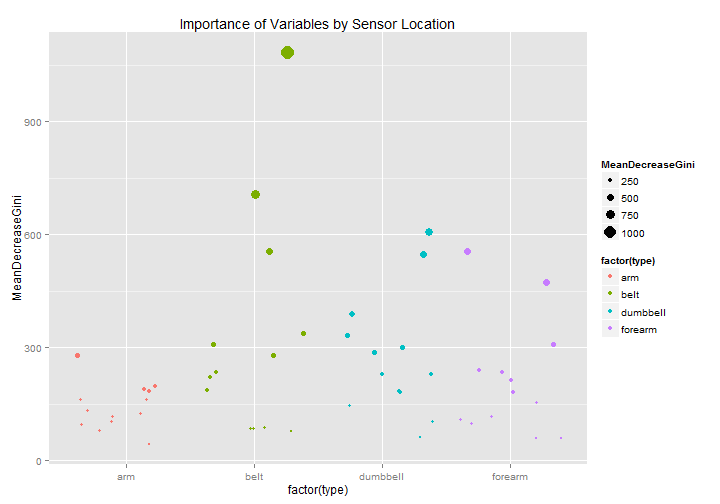

# Practical Machine Learning course project

## Introduction
In this project, we use the Weight Lifting Exercises Dataset provided by [Groupware@LES](http://groupware.les.inf.puc-rio.br/har#weight_lifting_exercises#weight_lifting_exercises) to create a machine which classifies the quality of a person's Unilateral Dumbell Biceps Curl exercises based on a number of sensor readings.

Groupware classified one "correct" curl, labeled "A", and five "incorrect" curls labelled "B" through "C":

- A: correct unilateral dumbell biceps curl
- B: throwing the elbows to the front
- C: lifting the dumbbell only halfway
- D: lowering the dumbbell only halfway
- E: throwing the hips to the front

## Approach
I am a bit unsure exactly which methods will be most useful, so I will partition the data into three parts. A training set, an initial test set (named midTest), and then a small error estimation set. I will build an array of rpart and Random Forest models on the training set. The best model will then be chosen on the midTest sample, and the final out of sample error of the best model will be estimated on the errorEstSample sample.

## Load data
I chose 80%, 15%, and 5%, respectively for my training, midTest, and error estimation samples. As these were partitioned sequentially from smallest to largest, the actual shares of the training data are  76%, 14.25%, and 5%, respectively.


```r
library(Hmisc)  #data exploration
```

```
## Loading required package: grid
## Loading required package: lattice
## Loading required package: survival
## Loading required package: splines
## Loading required package: Formula
## 
## Attaching package: 'Hmisc'
## 
## The following objects are masked from 'package:base':
## 
##     format.pval, round.POSIXt, trunc.POSIXt, units
```

```r
library(caret)  #machine learning
```

```
## Loading required package: ggplot2
## 
## Attaching package: 'caret'
## 
## The following object is masked from 'package:survival':
## 
##     cluster
```

```r
library(rpart)  #rpart caret method
library(randomForest)  #random forest caret method
```

```
## randomForest 4.6-7
## Type rfNews() to see new features/changes/bug fixes.
## 
## Attaching package: 'randomForest'
## 
## The following object is masked from 'package:Hmisc':
## 
##     combine
```

```r
library(ggplot2)  #plotting

training <- read.csv("pml-training.csv")
testing <- read.csv("pml-testing.csv")

# partition data into training, probe, and estimation set for Out-of-Sample
# errors
set.seed(254684)
inErrorEstSample <- createDataPartition(y = training$classe, p = 0.05, list = FALSE)
errorEstSample <- training[inErrorEstSample, ]
training <- training[-inErrorEstSample, ]
inMidTest <- createDataPartition(y = training$classe, p = 0.15, list = FALSE)
midTest <- training[inMidTest, ]
training <- training[-inMidTest, ]
```


##Cleaning the data
The data is not initially suited for inclusion in a training model. First, there are a number of "bookkeeping" variables in the front which are not relevant to our goal of deriving classifications from sensor measurement data, so these must be cleared. 

After a bit of exploration it also became clear that many of the variables contained mostly missing values and that the non-missing values in these variables were coded as factor variables. I created a helper function which (with a few warnings) strips these variables from the data frame. I then applied this helper function to all the data sets.


```r
# helper function. Removes variables with no variance
myTrim <- function(df) {
    outcome <- df$classe
    df <- df[, 8:159]  #drop variables at front and outcome variable
    nonConstant <- apply(df, 2, function(x) !is.na(var(x)))
    df <- df[, nonConstant]  #drop constant variables
    df$classe <- outcome  #add outcome variable
    return(df)
}

# apply trim to samples
training <- myTrim(training)
midTest <- myTrim(midTest)
errorEstSample <- myTrim(errorEstSample)
testing <- myTrim(testing)
```


##Model Prediction
As noted, I am fitting an array of models; mainly bootstrapped rpart and random forests of different lengths. The fitting is quite computationally intensive. A helpful [internet source](http://stackoverflow.com/questions/22200923/different-results-with-formula-and-non-formula-for-caret-training) suggested using a non-formula interface to speed up computations when there are no factor variables in the data set. As I cleared out the factor variables above, I call the train function with a matrix and a vector, rather than a formula and a data parameter.


```r
# vary rpart tuneLength: 5-25
bootControl <- trainControl(method = "boot632", number = 25)
modelBoot5 <- train(training[, 1:52], training$classe, method = "rpart", trControl = bootControl, 
    tuneLength = 5)
```

```
## 
## Attaching package: 'e1071'
## 
## The following object is masked from 'package:Hmisc':
## 
##     impute
```

```r
modelBoot10 <- train(training[, 1:52], training$classe, method = "rpart", trControl = bootControl, 
    tuneLength = 10)
modelBoot15 <- train(training[, 1:52], training$classe, method = "rpart", trControl = bootControl, 
    tuneLength = 15)
modelBoot20 <- train(training[, 1:52], training$classe, method = "rpart", trControl = bootControl, 
    tuneLength = 20)
modelBoot25 <- train(training[, 1:52], training$classe, method = "rpart", trControl = bootControl, 
    tuneLength = 25)
```


```r
# vary rf tuneLength: 1-3
modelRF1 <- train(training[, 1:52], training$classe, method = "rf", tuneLength = 1, 
    ntree = 25)
modelRF2 <- train(training[, 1:52], training$classe, method = "rf", tuneLength = 2, 
    ntree = 25)
modelRF3 <- train(training[, 1:52], training$classe, method = "rf", tuneLength = 3, 
    ntree = 25)
```


## Comparing the models
The code below basically calculates the accuracy of the various models above on the training and the midTest data sets and outputs a table of results.

```r
# compare models on the midTest data

# helper functions
myAccTrain <- function(x) {
    t <- confusionMatrix(data = predict(x, newdata = training), training$classe)
    return(t$overall[1])
}

myAccTest <- function(x) {
    t <- confusionMatrix(data = predict(x, newdata = midTest), midTest$classe)
    return(t$overall[1])
}

# list of models to compare
modelList <- list(modelBoot5 = modelBoot5, modelBoot10 = modelBoot10, modelBoot15 = modelBoot15, 
    modelBoot20 = modelBoot20, modelBoot25 = modelBoot25, modelRF1 = modelRF1, 
    modelRF2 = modelRF2, modelRF3 = modelRF3)

# create accuracy estimates
trainAccuracy <- lapply(modelList, myAccTrain)
testAccuracy <- lapply(modelList, myAccTest)

# combine and view results
overview <- cbind(names(modelList), trainAccuracy, testAccuracy)
overview
```

```
##                           trainAccuracy testAccuracy
## modelBoot5  "modelBoot5"  0.5437        0.5359      
## modelBoot10 "modelBoot10" 0.6854        0.666       
## modelBoot15 "modelBoot15" 0.7642        0.7413      
## modelBoot20 "modelBoot20" 0.7984        0.7814      
## modelBoot25 "modelBoot25" 0.8239        0.8131      
## modelRF1    "modelRF1"    1             0.995       
## modelRF2    "modelRF2"    1             0.9939      
## modelRF3    "modelRF3"    1             0.9936
```


The bootstrapped rpart models improve their fit as we increase tuneLength (as would be expected given increased subpartitioning), but even with 25 levels they do not compare to the random forest model with achieves a near-perfect fit in all cases. ModelRF1 is chosen as the fit is excellent and the computation time is less than for models RF2 and RF3.

## Model Error
As we have yet to use the third data set which we set aside for estimating the out of sample error of the best model, we can now employ it to accurately estimate the out of sample error rate of the modelRF1 predictior. Our best estimate for the Out of Sample error rate is 0.6%. It appears we can create a very accurate model of  Unilateral Dumbell Biceps Curl quality, given enough sensor data.

```r
confMat <- confusionMatrix(data = predict(modelRF1, newdata = errorEstSample), 
    errorEstSample$classe)
estimatedOOSErrorRate <- 1 - confMat$overall[[1]]  #1 - accuracy
estimatedOOSErrorRate
```

```
## [1] 0.007121
```

## A little more detail.
Random forests are hard to interpret, but the impratance variable does help this measure a bit.

```r
impData <- as.data.frame(importance(modelRF1$finalModel))

# identify measurement area
impData$rowname <- rownames(impData)
impData$type <- "arm"
belt <- lapply(impData$rowname, function(x) grepl(pattern = "belt", x))
forearm <- lapply(impData$rowname, function(x) grepl(pattern = "forearm", x))
dumbbell <- lapply(impData$rowname, function(x) grepl(pattern = "dumbbell", 
    x))
impData$type <- ifelse(belt, "belt", impData$type)
impData$type <- ifelse(forearm, "forearm", impData$type)
impData$type <- ifelse(dumbbell, "dumbbell", impData$type)
impData <- impData[order(impData$MeanDecreaseGini), ]
impData$index <- 1:52

importancePlot <- ggplot(impData, aes(index, MeanDecreaseGini, colour = factor(type), 
    size = MeanDecreaseGini)) + geom_point() + labs(title = "Importance of Variables by Sensor Location")
importancePlot
```

 


From the plot above it can be inferred that if we are limited in the number of sensors we can apply in the future, the best sensor location for distinguishing a correct unilateral dumbbell curl from various incorrect ones is the belt, followed by the dumbbell. Two of the foream variables have large importance, but the arm variable provides little additional information.


## Predicting on the supplied test set
All that is left is to apply the model to the supplied testing data. The resulting assignments can be seen below the r code:

```r
testPredictions <- predict(modelRF1, newdata = testing)
testStore$predicted_classe <- testPredictions
```

```
## Error: object 'testStore' not found
```

```r
head(testStore[c("user_name", "problem_id", "predicted_classe")], n = 20)
```

```
## Error: object 'testStore' not found
```

